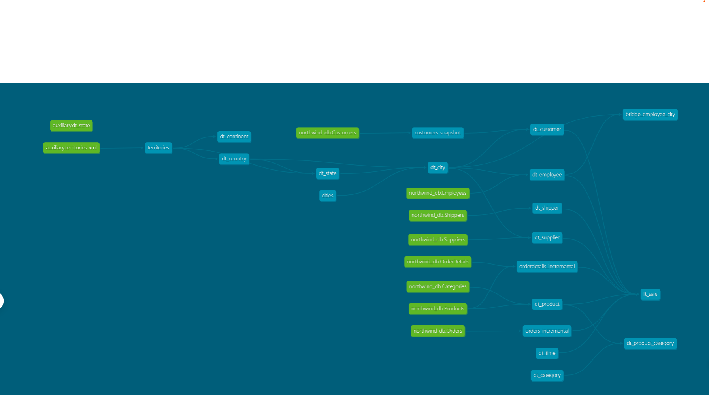

# Northwind Data Warehouse Project

This project builds a data warehouse using the **Northwind Postgres database** along with two auxiliary files:  
- **Time CSV**: for generating a time dimension  
- **XML file**: for adding Geography and City dimensions  

The ETL process was implemented using **dbt**, and **Snowflake** was chosen as the target schema.  

## Project Highlights

- **Dimensions & Fact Tables**: Designed and implemented core dimensions and fact tables for analysis  
- **Data Processing Mechanisms**:
  - **Changing Data Capture (CDC)**: Tracks changes in source data  
  - **Slowly Changing Dimensions (SCD)**: Manages historical changes in dimensions  

## Status
Work in progress –  final report will be added for fact and SCD handeling through snapshot.

